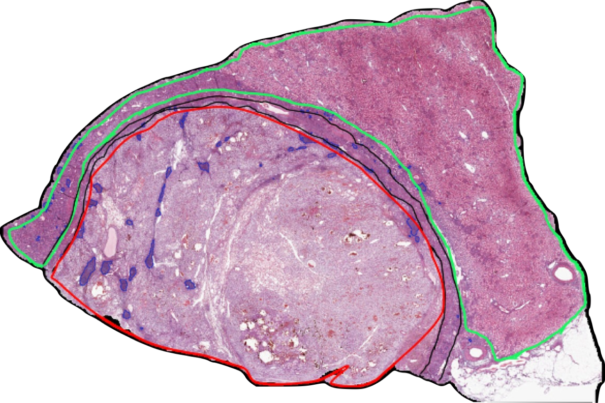

<!-- README.md is generated from README.Rmd. Please edit that file -->

# poseidon-maldi 

<!-- badges: start -->

<!-- badges: end -->

This repository contains the code required to reproduce the results
presented in the paper:

> **“Multiomics Tissue Segmentation via Spatially-Informed Nested
> Biclustering Methods”** F. Denti, C. Balocchi, V. Denti, and G.
> Capitoli

The manuscript is currently under review. A preprint is available on
[arXiv](https://arxiv.org/abs/2509.02482).

The repository also includes the `R` packages **Poser** and
**Poseidon**, which implement the variational inference algorithm and
supporting utilities used in the analyses. Installation instructions are
provided [below](#install).

------------------------------------------------------------------------

## Repository structure

### Simulation studies

Directories with names starting with `Simulation_` contain the code used
to reproduce the simulation studies presented in the paper.

Within each folder, `R` scripts should be executed in **alphabetical
order**.

An additional `README` file describing how to run competing methods is
available in: `Simulation_VaryingSpatial_competitors/`.

Overview of simulation folders:

- `Simulation_Study_CAM_drawback/` Reproduces results from Supplementary
  Section S.4.1

- `Simulation_Biclustering_recovery/` Reproduces results from
  Supplementary Section S.4.2

- `Simulation_VaryingSpatial_competitors/` Reproduces results from
  Supplementary Section S.4.3

- `Simulation_Study_Poseidon_vs_Pose/` Reproduces results from
  Supplementary Section S.4.4

- `Simulation_Study_Times/` Reproduces results from Supplementary
  Section S.4.5

------------------------------------------------------------------------

## CRCC data analysis

### Step 1: Download data and references

To reproduce the real-data analysis:

1.  Visit the *Bicocca Open Archive Research Data* repository at [this
    link](linkhttps://doi.org/10.17632/gxz9kjj2r9.1)
2.  Download all files
3.  Place them in the `Data/` directory

If you use these data, please cite:

> **Poseidon_data_ccRCC_application** Denti, V.; Capitoli, G. (2026)  
> Bicocca Open Archive Research Data, V1  
> <https://doi.org/10.17632/gxz9kjj2r9.1>

and the associated paper:

> **“Multiomics Tissue Segmentation via Spatially-Informed Nested
> Biclustering Methods”**  
> F. Denti, C. Balocchi, V. Denti, and G. Capitoli

------------------------------------------------------------------------

<style>
  .img-centrata {
    display: block;
    margin-left: auto;
    margin-right: auto;
    width: 50%;
  }
</style>



------------------------------------------------------------------------

### Step 2: Run the analysis scripts

The `CRCC_Analysis` folder contains **13 scripts**, which must be
executed in order:

- Scripts starting with `00` Perform data loading, exploratory data
  analysis (EDA), and construction of the adjacency matrix

- Scripts starting with `01`, `02`, `03`

  - `01`: Fit Pose models on individual datasets
  - `02`: Fit Pose on the stacked dataset
  - `03`: Fit Poseidon on the combined datasets

- Scripts starting with `04` Perform post-processing and extract results

Outputs are saved as follows:

- Plots → `Output/PLOT/`
- R objects (`.RDS`) → `Output/RDS/`

------------------------------------------------------------------------

### Step 3: Additional analyses

The folder `050_Additional_analyses/` contains code for deeper
exploration of the nested posterior structure inferred by the models.

Outputs from these analyses are saved directly within this folder.

------------------------------------------------------------------------

## Installation

Install the `Poser` and `Poseidon` packages from source using:

``` r
install.packages("R_packages/Poser_0.0.2.tar.gz", repos = NULL, type = "source") 
install.packages("R_packages/Poseidon_0.1.0.tar.gz", repos = NULL, type = "source") 
```

------------------------------------------------------------------------

## Issues

If you encounter any problems, please open an [issue on
GitHub](https://github.com/Fradenti/poseidon-maldi/issues).
